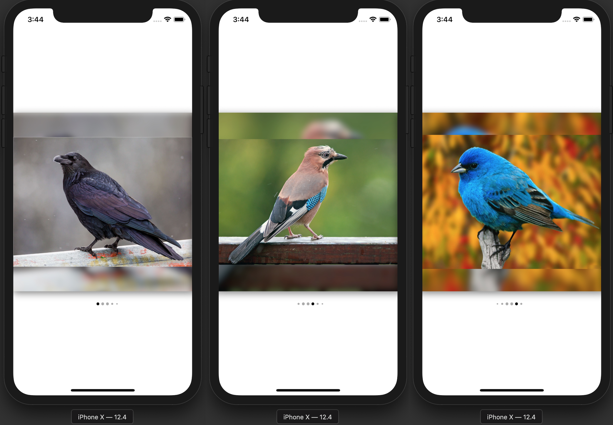

# FlexiblePageControlDemo

## Задание

Изучить [FlexiblePageControl](https://github.com/shima11/FlexiblePageControl) и заменить самописное решение в проекте ВТБ на эту библиотеку, при условии, что библиотека полностью подходит под нужды проекта. После этого описать достоинства и недостатки этой библиотеки.

## Пример работы

### Достоинства
* UI-элемент прост в использовании и кастомизации
* у крупной точки не обрезаются края (в отличии от самописного решения)

### Недостатки
* нет возможности сделать только одну точку крупнее остальных
* некорректное поведение контрола (displayCount в config’е ни на что не влияет)

## ВЫВОД

Интеграция библиотеки в текущем её виде в проект ВТБ нецелесообразна, т.к. она не подходит под его нужды.
Библиотека имеет множество fork’ов. Можно последовать примеру других разработчиков и сделать так же, но это уже отдельная задача.
